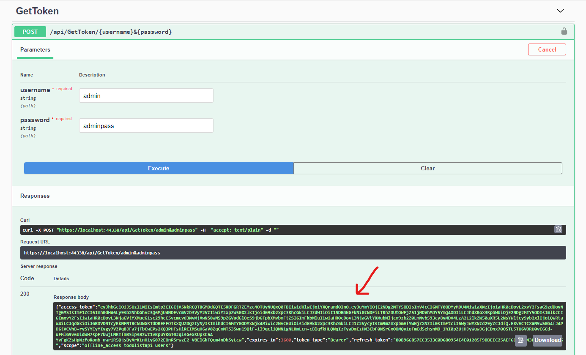
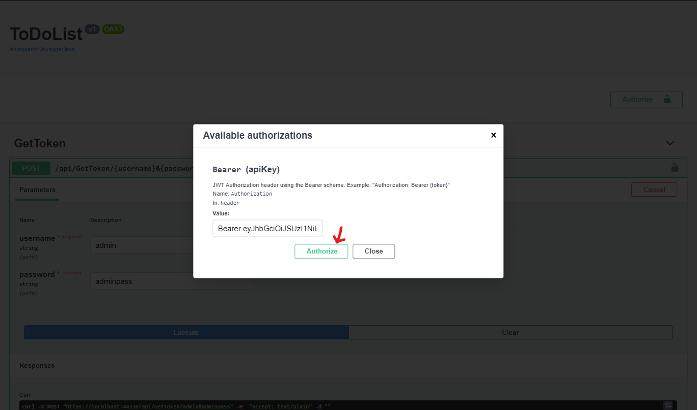

# To-Do-List-API
A to-do list web API for organization of day-to-day tasks.
Developed using Test First approach, using Swagger UI for making requests to the application.

To Authorize your request, use the GetToken endpoint. Copy the generated token from the response.

 The format should be “Bearer 123xyzx2sff”. Press the Authorize button to set your Authorization header on all the requests from methods displayed in a swagger dashboard. See the screenshot below.
 

